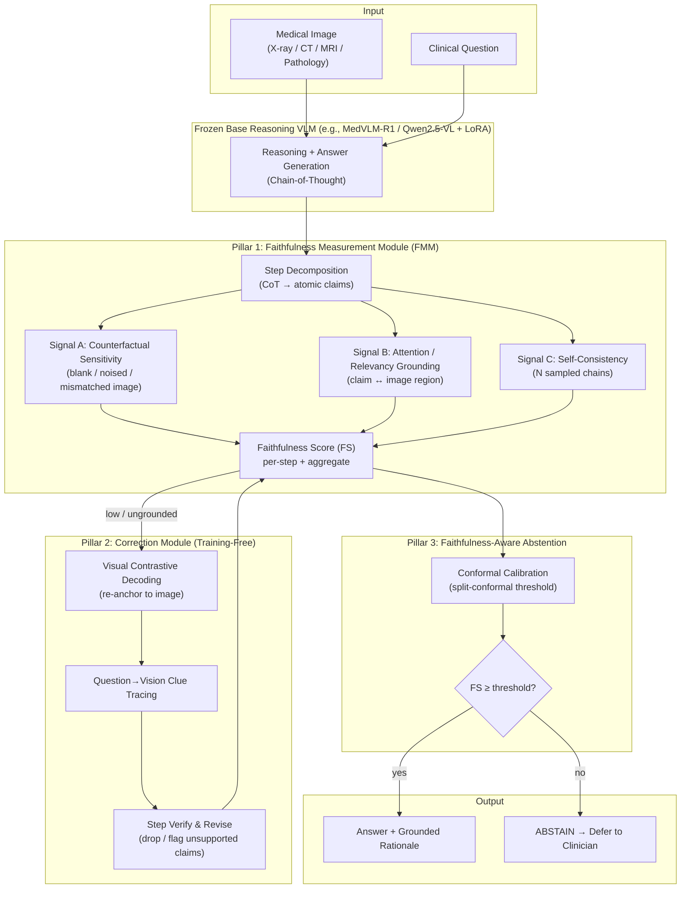

# Faithful Medical Reasoning (FMR)
### A Training-Free Faithfulness Verification & Abstention Layer for Multi-Modality Medical Visual Question Answering

> **One-line pitch:** Medical AI that "thinks out loud" *sounds* trustworthy — but its reasoning often is not actually looking at the scan, and the more it reasons, the worse this gets. FMR is a lightweight, model-agnostic layer that **measures** whether a medical VLM's reasoning is grounded in the image, **corrects** it when it drifts, and **abstains** (defers to a clinician) when it cannot be verified.

**B.Tech Thesis Project Proposal & Implementation Plan**
**Codename:** FMR · **Domain:** Multimodal Medical AI / Trustworthy Vision-Language Models · **Data:** Fully open

---

## Table of Contents
1. [Executive Summary](#1-executive-summary)
2. [Problem & Motivation](#2-problem--motivation)
3. [Research Gap & Novelty](#3-research-gap--novelty-what-is-new-to-knowledge)
4. [Research Questions & Objectives](#4-research-questions--objectives)
5. [System Architecture](#5-system-architecture)
6. [Methodology — The Three Pillars](#6-methodology--the-three-pillars)
7. [Datasets (Fully Open)](#7-datasets-fully-open)
8. [Baselines & Positioning vs. Literature](#8-baselines--positioning-vs-literature)
9. [Evaluation Protocol & Metrics](#9-evaluation-protocol--metrics)
10. [Stage-by-Stage Plan (Start → End)](#10-stage-by-stage-plan-start--end)
11. [Full Timeline](#11-full-timeline)
12. [Technology Stack (Modest & Robust)](#12-technology-stack-modest--robust)
13. [Hardware & Compute](#13-hardware--compute)
14. [Risk Analysis & Mitigation](#14-risk-analysis--mitigation)
15. [Expected Contributions & Deliverables](#15-expected-contributions--deliverables)
16. [Proposed Repository Structure](#16-proposed-repository-structure)
17. [Key References](#17-key-references)

---

## 1. Executive Summary

The newest wave of medical AI consists of **reasoning vision-language models (VLMs)** — models like MedVLM-R1 that generate an explicit step-by-step "chain-of-thought" before answering, aiming for transparency and clinician trust. There is a serious, under-recognized problem: **a fluent, clinically-plausible reasoning chain can be completely disconnected from the actual image.** Recent general-domain studies show that (a) reasoning chains are frequently *unfaithful* — they do not reflect what the model actually "sees"; (b) answer correctness and reasoning faithfulness diverge; and (c) counterintuitively, models that reason *more* often attend to the image *less*, hallucinating more than their non-reasoning versions. In medicine, where an authoritative-sounding but ungrounded rationale can directly mislead a clinician, this is a safety-critical gap — and it is barely studied.

**FMR** is a model-agnostic, **largely training-free** layer that wraps any open-source medical reasoning VLM and does three things:

1. **Measure** the visual faithfulness of each reasoning step (does it depend on the image, or on language priors?).
2. **Correct** ungrounded reasoning at decode time using established, robust, training-free techniques (Visual Contrastive Decoding + question-to-vision clue tracing + step-wise verification).
3. **Abstain** with a *calibrated guarantee* — when faithfulness cannot be verified, FMR defers to a human instead of confidently guessing.

FMR is **hybrid by design**: the core is training-free (so it always works and is fully reproducible), and an *optional* **learned faithfulness verifier** — plus optional **faithfulness-LoRA** fine-tuning of the base model — adds a measurable trained improvement on top, each with a training-free fallback. This gives the project a genuine "we trained something and it provably helped" result without putting the working system at the mercy of a fragile training run (see §6, *Optional Trained Enhancement Track*).

The project is evaluated across **four imaging modalities** (X-ray, CT, MRI, pathology) on **fully open** benchmarks, against the standard open medical VLM baselines. It runs on a **single 24 GB GPU** (or free/Pro cloud notebooks), because the core pipeline needs no model training.

---

## 2. Problem & Motivation

### 2.1 The clinical problem
Medical VLMs are being pushed toward clinical decision support (diagnosis assistance, report drafting, visual question answering). For a clinician to trust and act on an AI suggestion, they need to know *why* the model concluded what it did. The field's answer has been **reasoning models**: produce a natural-language rationale alongside the answer. The implicit assumption is that a readable rationale = a trustworthy, image-grounded decision.

### 2.2 Why that assumption fails
This assumption is false in three documented ways:

- **Reasoning ≠ looking.** Multimodal reasoning models tend to shift attention away from image evidence as the reasoning chain grows, increasing reliance on language priors — and can hallucinate *more* than their non-reasoning counterparts.
- **Plausible ≠ faithful.** A model can produce a confident, clinically-styled rationale that references findings *not present* in the scan, or reach the right answer for the wrong (non-visual) reasons.
- **Accuracy hides it.** Standard benchmarks report only final-answer accuracy, which cannot reveal whether the reasoning genuinely used the image. Many medical VQA questions are even answerable *without the image* by exploiting dataset/language priors.

In a clinical setting this is dangerous: an ungrounded but fluent rationale provides false reassurance ("automation bias"), and the model gives no signal that it is unreliable for a given case.

### 2.3 Why now
Medical reasoning VLMs (MedVLM-R1, Med-R1, Lingshu, HuatuoGPT-Vision, MedGemma) emerged in 2025. Faithfulness of reasoning has just begun to be *measured* in medicine (late 2025), and a few grounding *methods* are appearing (e.g., MedEyes). But **no work unifies measurement + correction + clinical abstention into a single, model-agnostic, deployable layer.** This is a timely, active frontier with a clear, defensible opening — exactly where a strong thesis should sit.

---

## 3. Research Gap & Novelty (What Is New to Knowledge)

| Prior line of work | What it does | What it is missing |
|---|---|---|
| Medical reasoning VLMs (MedVLM-R1, Med-R1, Lingshu) | Generate reasoning chains for better accuracy/interpretability | No verification that the chain is image-grounded; no abstention |
| Medical reasoning-faithfulness *evaluation* (2025) | Measures faithfulness via perturbations | Evaluation only; single/few modalities; no correction or trust mechanism |
| Visual grounding in reasoning, general domain (CoRGI, Ground-R1, GCoT, ClueTracer) | Verify/ground reasoning steps | Not medical; not multi-modality clinical imaging; no clinical deferral |
| Counterfactual debiasing for Med-VQA (DeCoCT, 2025) | Reduces language bias in *answers* | Targets short answers, not multi-step reasoning chains; no faithfulness-driven abstention |
| Training-free hallucination decoding (VCD, ClueTracer) | Reduce hallucination at decode time | General-domain; not connected to faithfulness scoring or abstention in medicine |

**FMR's novel contributions:**

1. **First unified, model-agnostic *faithfulness layer* for medical reasoning VLMs** — combining measurement, correction, and abstention in one pipeline that plugs into any open base model.
2. **A multi-modality faithfulness diagnostic** that demonstrates the counterintuitive "more reasoning → less grounded" effect *in the medical domain*, across X-ray / CT / MRI / pathology, with a reasoning-vs-non-reasoning comparison.
3. **Faithfulness-aware abstention with a calibrated guarantee** — a genuinely new trust signal that triggers human deferral based on *reasoning-grounding*, not just answer confidence, using distribution-free (conformal) calibration.
4. **A hybrid design: a training-free robust core + a trained enhancement that measurably helps.** The core works on a *frozen* base model using established techniques (Visual Contrastive Decoding, attention/relevancy analysis, self-consistency, split-conformal) — reproducible, cheap, always-working — while an optional **learned faithfulness verifier** (a small trained head that fuses the measurement signals) and optional **faithfulness-LoRA** provide a measurable trained gain on the project's central quantity, with the training-free path as a guaranteed fallback.
5. **An explicit answer to "is grounding decodable or learnable?"** — by comparing the training-free decode-time correction against faithfulness-LoRA (moving grounding into the weights), FMR studies *both* routes to faithful reasoning rather than assuming one.

> **Honesty note for the defense:** this is a fast-moving frontier. FMR's defensibility comes from *unifying* scattered pieces into a deployable, evaluated system and from the *abstention* angle — not from claiming an empty field. Position it as "we make medical reasoning models verifiable and safe to defer," and benchmark openly against the seed papers above.

---

## 4. Research Questions & Objectives

**Research Questions**
- **RQ1 (Diagnosis):** Across imaging modalities, how faithful are the reasoning chains of open medical VLMs to the actual image — and do reasoning-tuned models become *less* grounded than non-reasoning baselines?
- **RQ2 (Measurement):** Can a robust, multi-signal faithfulness score (counterfactual sensitivity + attention grounding + self-consistency) reliably separate grounded from ungrounded reasoning, validated against ground-truth regions where available?
- **RQ3 (Correction):** Can training-free decode-time methods (Visual Contrastive Decoding + clue tracing + step verification) measurably improve reasoning faithfulness *without* hurting accuracy?
- **RQ4 (Trust):** Can faithfulness-aware, conformally-calibrated abstention deliver a target error rate on retained cases while deferring the rest, outperforming confidence-only abstention?
- **RQ5 (Trained enhancement):** Does a *learned* faithfulness verifier (a small head trained to fuse the measurement signals) outperform the hand-weighted heuristic score at separating grounded from ungrounded reasoning and at driving abstention — and can parameter-efficient **faithfulness-LoRA** move grounding into the base model's weights, complementing decode-time correction?

**Objectives**
- **O1.** Build a reproducible multi-modality Med-VQA evaluation harness over fully open datasets.
- **O2.** Implement and validate a multi-signal **Faithfulness Score (FS)**.
- **O3.** Implement the **training-free correction module** and quantify faithfulness/accuracy trade-offs.
- **O4.** Implement and calibrate the **faithfulness-aware abstention** head; produce risk–coverage analysis.
- **O5.** Run the full benchmark vs. baselines; deliver ablations, the open-source layer, and the thesis.
- **O6.** *(Stretch)* Implement and evaluate the optional trained enhancements — the **learned faithfulness verifier** (vs. the heuristic FS) and **faithfulness-LoRA** (vs. the frozen base) — each with a training-free fallback, and report whether the trained component measurably helps.

---

## 5. System Architecture

FMR is a wrapper around a frozen (or lightly LoRA-adapted) open medical reasoning VLM. Input is a **medical image** (any of X-ray/CT/MRI/pathology) + a **clinical question**. Output is an **answer + a faithfulness-verified rationale + an ABSTAIN/DEFER flag**.



**Data flow in words:** the base model generates a rationale + answer → FMM decomposes the rationale and scores each step's visual faithfulness using three independent signals → if faithfulness is low, the Correction Module re-generates with image-anchored decoding and verifies/revises steps → the (possibly corrected) faithfulness score is passed through a conformally-calibrated gate → the system either returns the grounded answer or **abstains and defers**.

> **Optional trained enhancements (drop-in, reversible).** Two nodes in the diagram can be upgraded with a trained component: the **FS aggregator** can be a *learned faithfulness verifier* (a small head trained to fuse Signals A/B/C, replacing the hand-weighted score), and the **base reasoning VLM** can be *faithfulness-LoRA*-tuned. Both are additive upgrades — the heuristic FS and the frozen base remain as guaranteed fallbacks, so the pipeline above runs end-to-end with zero training. See §6, *Optional Trained Enhancement Track*.

---

## 6. Methodology — The Three Pillars

### Pillar 1 — Faithfulness Measurement Module (FMM)
Robustness principle: **never trust a single signal.** Attention alone is a contested explanation; counterfactuals alone can be brittle. FMM fuses three complementary, well-established signals.

- **Signal A — Counterfactual sensitivity.** Re-run the model with (i) the original image, (ii) a blanked/Gaussian-noised image, and (iii) a *mismatched* image. A faithful rationale/answer should *change* when the true image is removed/replaced. Quantify via answer-flip rate and output-distribution divergence (e.g., JS divergence over answer logits). *(Inspired by Visual Contrastive Decoding's distorted-input contrast and perturbation-based faithfulness evaluation.)*
- **Signal B — Attention / relevancy grounding.** Extract image-region relevance for each reasoning-step's key clinical terms using attention rollout / relevancy maps / token-activation maps. Where datasets provide bounding boxes/masks (SLAKE, VQA-RAD), validate grounding via IoU between predicted evidence regions and ground-truth regions.
- **Signal C — Self-consistency.** Sample *N* reasoning chains at non-zero temperature; measure agreement among extracted claims/answers (RadFlag-style). High variance ⇒ low confidence/faithfulness.

**Faithfulness Score (FS).** Combine the three signals (per-step and aggregate) into a single calibrated scalar in [0,1]. Start with a simple, interpretable weighting; optionally fit weights with light logistic regression on a small labeled subset.

### Pillar 2 — Correction Module (Training-Free)
Applied when FS is low. All components are decode-time and require **no training**:

- **Visual Contrastive Decoding (VCD).** Contrast next-token distributions from the original vs. a distorted image to suppress language-prior-driven tokens and amplify image-grounded ones. (Public CVPR-2024 implementation exists.)
- **Question-to-vision clue tracing (ClueTracer-style).** Trace each reasoning clue back to supporting visual evidence to suppress unsupported continuations.
- **Step verify-and-revise (CoRGI-style).** Decompose the rationale, check each atomic claim's visual support, **drop or flag** unsupported claims, and regenerate the final answer from the *verified* claims only.

### Pillar 3 — Faithfulness-Aware Abstention (with Guarantee)
- Use **split-conformal calibration** on a held-out calibration set to choose an FS threshold that controls the error rate on *retained* (non-abstained) predictions at a user-specified level (e.g., ≤ 5%).
- This yields a **distribution-free coverage guarantee**: among the cases the system answers, the error rate is provably bounded (in expectation), and the rest are deferred to a clinician.
- Compare against the naive baseline (abstain on low *answer confidence*) to show faithfulness is a better deferral trigger.

### Optional Trained Enhancement Track — Learned Faithfulness Verifier & Faithfulness-LoRA

> **Design rationale (training-free vs. trained — the honest version).** Scientifically, a training-free system is *not* a weakness: the strongest decode-time methods (e.g., Visual Contrastive Decoding — a CVPR 2024 Highlight) train nothing and still set state of the art, and training-free work routinely wins top venues. But in practice some B.Tech examiners read *"trained a model"* as a proxy for depth and effort. We resolve this **without compromising robustness** by making FMR a hybrid: the training-free core always works and is the fallback; on top of it we add **one trained component that measurably improves results**, plus an optional fine-tuned base model. The narrative becomes *"we trained something and it provably helped"* — with a guaranteed-working baseline underneath. Crucially, both trained pieces are *additive and reversible*: if a training run underperforms or is unstable, we revert to the training-free path and report the negative result honestly. The trained components are added to *strengthen* the work, not for show.

**A. Learned Faithfulness Verifier (the trained upgrade to Pillar 1).**
- *What it is.* A lightweight learned head (a small MLP, or a gradient-boosted model such as LightGBM; ~10²–10⁵ params) that **replaces the hand-weighted fusion** of Signals A/B/C in the Faithfulness Score with a *learned, non-linear* fusion predicting, per reasoning step, the probability that the step is image-grounded.
- *Inputs (features).* The three FMM signals (counterfactual sensitivity, attention/relevancy grounding, self-consistency) plus cheap auxiliaries already computed by the harness: pooled step-token embedding, pooled attended-region embedding, step length/position, and the answer-logit margin.
- *Labels (no manual-annotation bottleneck).* Grounding labels are derived from data the pipeline already produces: (i) on **SLAKE / VQA-RAD**, attention-region ↔ ground-truth-box **IoU** yields a grounded/ungrounded label; (ii) **counterfactual** answer-flip behaviour gives weak labels (a faithful step's answer changes when the image is removed/swapped); (iii) optionally a small hand-labelled set + LLM-judge for calibration. The verifier is trained on a split kept strictly disjoint from the conformal-calibration and test sets.
- *Why it genuinely helps (not cosmetic).* The hypothesis — and the experiment — is that a learned fusion of three *noisy* signals beats any fixed hand-tuned weighting (the heuristic FS), improving step-level faithfulness classification (**AUROC / AUPRC**) and, downstream, the **risk–coverage** curve for abstention. We report the verifier vs. the heuristic FS head-to-head: **if** the learned head wins, it ships as the default scorer; **if not**, the heuristic FS remains and the comparison is reported as an honest negative result.
- *Fallback.* The heuristic FS (Pillar 1) is always available; the verifier is a drop-in replacement, never a dependency.

**B. Faithfulness-LoRA (optional base-model fine-tuning).**
- *What it is.* Parameter-efficient (**LoRA / QLoRA**) fine-tuning of the *base* VLM to reason more faithfully — optimised not for raw accuracy but to raise the verifier's grounding score. Training targets are the **verified, grounded rationales** produced by the training-free correction module (a self-distillation / self-training loop), optionally with **preference pairs** (grounded chain ≻ ungrounded chain) for DPO-style tuning.
- *Why it fits the thesis.* It answers RQ3 from the other side: can grounding be moved *into the weights*, not just enforced at decode time? It is a clean, self-contained *"we fine-tuned a medical VLM and faithfulness improved"* result, runnable on a single 24 GB GPU via QLoRA.
- *Fallback.* The **frozen** base model is the default; faithfulness-LoRA is reported as an ablation, so the demo never depends on a fragile training run.

**Positioning of the hybrid.** Training-free core ⇒ robustness, reproducibility, and an MVP that *always works*. Learned verifier ⇒ depth and a measurable trained gain on the project's central quantity (faithfulness). Faithfulness-LoRA ⇒ an additional trained result and a direct answer to *"can grounding be learned, not just decoded?"* Each trained piece is optional, additive, and reversible — the working system is never at risk.

---

## 7. Datasets (Fully Open)

All datasets below are openly downloadable (no credentialed access / no Data Use Agreement gatekeeping like MIMIC).

| Dataset | Modalities | Role in FMR | Notes |
|---|---|---|---|
| **VQA-RAD** | X-ray, CT (head/chest/abdomen) | Core eval + grounding GT | Small, clinician-authored; some region info |
| **SLAKE** (English split) | CT, MRI, X-ray | Core eval + **grounding GT** | **Bounding boxes / segmentation + knowledge graph** → validates Signal B |
| **PathVQA** | Pathology | Modality breadth | Tests transfer beyond radiology |
| **OmniMedVQA** (public subset) | 12 modalities | Breadth + held-out modality | Use a sampled subset for compute |
| *(Optional)* **Kvasir-VQA** | GI endoscopy | Extra modality | Open challenge dataset |
| *(Optional)* **IU-Xray** (Open-i) | Chest X-ray | Extra eval / report context | Fully open; has indication/findings text |

**Why this mix:** VQA-RAD + SLAKE give clean, region-annotated radiology to *validate* the faithfulness metric; PathVQA + OmniMedVQA give the multi-modality breadth that makes the study substantial and tests generalization (including a **held-out modality** experiment).

---

## 8. Baselines & Positioning vs. Literature

**Base / comparison models (all open):**
- **Medical reasoning VLMs:** MedVLM-R1, Med-R1, Lingshu, HuatuoGPT-Vision, MedGemma.
- **Medical non-reasoning VLMs:** LLaVA-Med (for the reasoning-vs-non-reasoning comparison).
- **General backbones:** Qwen2.5-VL (2B/7B), InternVL (as a frozen base for the layer).

**Method comparisons (what your correction/abstention competes with):**
- **Decode-time:** Visual Contrastive Decoding (VCD), ClueTracer, "Paying More Attention to Image."
- **Reasoning verification:** CoRGI (post-hoc grounded verification), Ground-R1 (grounded reasoning).
- **Abstention:** confidence-thresholding, self-consistency thresholding, RadFlag-style flagging.

**Positioning statement:** *Prior medical reasoning models add rationales but never verify them; prior faithfulness work is general-domain or evaluation-only; FMR is the first model-agnostic, training-free layer that measures, corrects, and conformally abstains on medical reasoning faithfulness across modalities.*

---

## 9. Evaluation Protocol & Metrics

**Task performance**
- Closed/MC and open-ended VQA accuracy, reported **per modality** and overall.
- Open-ended answers scored with an LLM-as-judge + human spot-check on a sample.

**Faithfulness (the headline)**
- **Answer–Grounding Consistency:** agreement between the final answer and the grounded evidence.
- **Step Visual-Support Rate:** fraction of reasoning steps with verifiable visual support.
- **Counterfactual Robustness:** answer-flip rate under image removal/replacement (faithful = appropriate change).
- **Attention–Region IoU:** on SLAKE/VQA-RAD where boxes exist.
- **Headline experiment:** reasoning vs. non-reasoning faithfulness gap (test the "more reasoning → less grounded" hypothesis in medicine).
- **Step-faithfulness classification:** AUROC / AUPRC of the faithfulness score against derived grounding labels — reported for the **heuristic FS vs. the learned verifier** (does the trained fusion actually win?).

**Trust / abstention**
- **Calibration:** Expected Calibration Error (ECE), reliability diagrams.
- **Selective prediction:** risk–coverage curves; accuracy on retained set at fixed coverage.
- **Guarantee check:** empirical error on retained set vs. the conformal target.

**Ablations**
- Each faithfulness signal (A/B/C) added incrementally.
- Correction on/off (VCD, clue tracing, step verification individually).
- Abstention trigger: faithfulness-based vs. confidence-based.
- Base-model sensitivity (apply FMR to ≥2 different base VLMs to show model-agnosticism).
- **Heuristic FS vs. learned verifier** (does the trained signal-fusion beat hand-weighting?).
- **Frozen base vs. faithfulness-LoRA** (can grounding be partly moved into the weights without hurting accuracy?).

---

## 10. Stage-by-Stage Plan (Start → End)

> The plan is split into a **Core track (must-do, guarantees a complete thesis)** and a **Stretch track (raises it to "outstanding")**. Always finish Core before Stretch.

**Stage 0 — Setup & Literature (foundation).**
Set up environment, GPU/cloud, repo, experiment logging. Read and summarize the seed papers (faithfulness, VCD, MedVLM-R1, the Med-VQA benchmarks). Write the related-work section early. *Deliverable: working environment + literature matrix.*

**Stage 1 — Data & Harness.** *(Core)*
Download and preprocess VQA-RAD, SLAKE, PathVQA, an OmniMedVQA subset. Build a unified loader + a reproducible inference/evaluation harness. Standardize splits, including a held-out modality split. *Deliverable: data pipeline + eval harness + dataset statistics.*

**Stage 2 — Base-Model Baselines & the Blind Test.** *(Core)*
Run ≥2 open base VLMs (1 reasoning, 1 non-reasoning) on all benchmarks. Run the **image-blind / image-distorted** tests. *This already yields a publishable finding: how much these models rely on text vs. image.* *Deliverable: baseline accuracy + first faithfulness evidence.*

**Stage 3 — Faithfulness Measurement Module (FMM).** *(Core)*
Implement Signals A, B, C and the aggregate FS. Validate Signal B against SLAKE/VQA-RAD boxes. Produce the **reasoning vs. non-reasoning faithfulness comparison** (headline result). *Deliverable: FMM + validated FS + headline plots.*

**Stage 4 — Correction Module.** *(Core for VCD; Stretch for clue tracing + step verify)*
Integrate Visual Contrastive Decoding (training-free). Measure faithfulness/accuracy trade-off. Then add clue tracing and step verify-and-revise. *Deliverable: correction module + before/after faithfulness gains.*

**Stage 5 — Faithfulness-Aware Abstention.** *(Core)*
Implement split-conformal calibration over FS; produce risk–coverage curves; compare vs. confidence-based abstention; verify the coverage guarantee empirically. *Deliverable: abstention module + selective-prediction analysis.*

**Stage 6 — Full Benchmark, Ablations, Model-Agnosticism.** *(Core + Stretch)*
Run the complete comparison vs. baselines and method competitors; full ablation suite; apply FMR to a second base model to demonstrate model-agnosticism; held-out-modality generalization. *Deliverable: complete results tables.*

**Stage 6½ — Trained Enhancements (learned verifier + faithfulness-LoRA).** *(Stretch — gives the "we trained something that helped" result.)*
Train the **learned faithfulness verifier** on derived grounding labels (IoU + counterfactual weak labels) and benchmark it head-to-head against the heuristic FS (AUROC/AUPRC + risk–coverage). Optionally run **faithfulness-LoRA** (QLoRA self-distillation / DPO on verified grounded rationales) and report it as an ablation vs. the frozen base. Both reuse generations already cached in earlier stages and need only a few GPU-hours; **if either fails to beat its training-free fallback, report it honestly and keep the fallback.** *Deliverable: trained-vs-training-free comparison + the trained-component result.*

**Stage 7 — Write-up & Release.** *(Core)*
Write the thesis; clean and release the code + faithfulness-eval suite; prepare a paper/workshop draft and the defense slides. *Deliverable: thesis + open-source repo + slides (+ paper draft).*

---

## 11. Full Timeline

Two views: a **compressed single-semester (~16 weeks)** plan and a **standard two-semester (~30 weeks)** plan. Pick based on your program. Each phase lists Core vs. Stretch.

### A) Standard two-semester plan (~30 weeks)

| Weeks | Phase | Track | Milestone |
|---|---|---|---|
| 1–3 | Stage 0: Setup + Literature | Core | Env ready; related-work draft; literature matrix |
| 4–6 | Stage 1: Data + Harness | Core | Unified loaders + eval harness running |
| 7–9 | Stage 2: Baselines + Blind Test | Core | Baseline numbers + first faithfulness evidence |
| 10–13 | Stage 3: FMM (Signals A/B/C + FS) | Core | Validated faithfulness score; **headline plot** |
| 14–15 | **Mid-term checkpoint + report** | Core | Interim report / advisor review |
| 16–18 | Stage 4: Correction (VCD) | Core | Faithfulness gains vs. baseline |
| 19–20 | Stage 4+: Clue tracing + step verify | Stretch | Full correction module |
| 21–23 | Stage 5: Conformal abstention | Core | Risk–coverage analysis + guarantee check |
| 24–26 | Stage 6: Full benchmark + ablations + 2nd base model | Core/Stretch | Complete results tables |
| 27–28 | Stage 7: Thesis writing | Core | Full draft |
| 29–30 | Buffer + polish + slides + repo release | Core | Final thesis, defense slides, open-source repo |

### B) Compressed single-semester plan (~16 weeks)

| Weeks | Focus | Notes |
|---|---|---|
| 1–2 | Setup + literature + data harness | Move fast; reuse open repos |
| 3–4 | Baselines + blind test | Lock the "models rely on text" result |
| 5–7 | FMM + Faithfulness Score | Headline reasoning-vs-non-reasoning result |
| 8–9 | Correction (VCD only) | Keep correction minimal but solid |
| 10–11 | Conformal abstention | Core trust contribution |
| 12–13 | Benchmark + key ablations | 2–3 datasets, 2 base models |
| 14–16 | Write-up + slides + release | Reserve full 2 weeks for writing |

> **Scheduling principles:** (1) Stages 2 and 3 alone constitute a complete, defensible thesis — protect them. (2) Everything in the core track is **training-free**, so compute risk is low; LoRA fine-tuning is optional polish. (3) Keep a 1–2 week buffer; experiments always overrun. (4) The optional **trained enhancements** (learned verifier + faithfulness-LoRA, Stage 6½) live entirely in the Stretch track, reuse cached generations, and need only a few GPU-hours — they add the "we trained something that measurably helped" result *without* endangering the training-free MVP.

---

## 12. Technology Stack (Modest & Robust)

Deliberately conventional, battle-tested tooling — nothing exotic, everything reproducible.

| Layer | Choice | Why |
|---|---|---|
| Framework | **PyTorch** | Standard; all models/tools support it |
| Model hub & inference | **Hugging Face Transformers** | Open VLMs (Qwen2.5-VL, MedVLM-R1, LLaVA-Med, MedGemma) available off the shelf |
| Efficient adapters (optional) | **PEFT (LoRA) + bitsandbytes (4-bit QLoRA)** | Fit 2–7B models on one 24 GB GPU; powers optional **faithfulness-LoRA** (self-distillation / DPO on verified grounded rationales) |
| Learned verifier (optional) | **scikit-learn / LightGBM** or a small **PyTorch MLP** head | Trained fusion of Signals A/B/C (~minutes to train); the "we trained something that helped" component; heuristic FS is the fallback |
| Preference tuning (optional) | **TRL (DPO)** | Grounded-≻-ungrounded preference pairs for faithfulness-LoRA |
| Fast generation | **vLLM** or HF `generate` | Throughput for repeated sampling (Signal C) |
| Decoding intervention | **Custom logits processor** for VCD (public reference impl.) | Training-free correction |
| Attention/relevancy | Attention rollout / **Grad-CAM-style hooks** / token-activation maps | Signal B; simple forward hooks |
| Conformal abstention | **Split-conformal** (~30 lines) or `torchcp` | Distribution-free guarantee, minimal dependency |
| Datasets | HF Datasets / official repos | VQA-RAD, SLAKE, PathVQA, OmniMedVQA |
| Experiment tracking | **Weights & Biases** or **TensorBoard** | Reproducibility, plots |
| Eval/LLM-judge | A small open LLM or API judge + human spot-check | Open-ended answer scoring |
| Repro | **Conda/venv + requirements.txt + fixed seeds + config files (YAML)** | Reproducibility for the thesis |

**Robustness choices baked in:** multi-signal faithfulness (no single point of failure), training-free core (no unstable training dynamics), closed/MC subsets for clean metrics, and a second base model to prove the method is not model-specific.

---

## 13. Hardware & Compute

| Resource | Minimum | Comfortable |
|---|---|---|
| GPU | 1× 16 GB (T4 / Colab) with 2–3B models + QLoRA | 1× 24 GB (RTX 3090/4090, A5000) |
| Cloud alternative | **Kaggle (T4 ×2 / P100, free)** or **Colab Pro (A100/L4)** | University GPU node |
| RAM | 16 GB | 32 GB |
| Storage | ~50 GB (subset datasets + checkpoints) | ~150 GB |
| Training time | Near-zero (core is training-free) | A few hours if optional LoRA used |

Because the core pipeline runs on a **frozen** base model, the dominant cost is *inference* (repeated sampling for Signal C and contrastive decoding), which is feasible on free/low-cost hardware. This is a key reason the project is robust to compute constraints.

---

## 14. Risk Analysis & Mitigation

| Risk | Likelihood | Mitigation |
|---|---|---|
| Fast-moving field; a similar paper appears | Medium | Scope to the *unified layer + abstention* angle; cite seeds; differentiate on the trust mechanism and multi-modality breadth |
| "Attention ≠ explanation" critique of Signal B | Medium | Use **three** signals; validate against ground-truth boxes; never rely on attention alone |
| Open-ended answer evaluation is noisy | Medium | Prioritize closed/MC subsets for clean metrics; LLM-judge + human spot-check for open-ended |
| Base reasoning VLM hard to run/fine-tune | Low/Med | Keep base **frozen**; use 2–3B models + QLoRA only if needed; everything core is decode-time |
| Compute limits | Medium | QLoRA, smaller models, dataset subsets, free Kaggle/Colab; cache generations |
| Correction hurts accuracy | Medium | Apply correction *selectively* (only when FS is low); report the trade-off curve, not a single point |
| Scope creep / overrun | High | Core/Stretch split; finish Stages 2–3 first; keep a 1–2 week buffer |
| Trained component (verifier / LoRA) underperforms or training is unstable | Medium | Each trained piece is *optional, additive, and reversible*; the training-free path is the default; revert and report the negative result — the MVP never depends on a training run |

---

## 15. Expected Contributions & Deliverables

**Scientific contributions**
1. Evidence (across modalities) on the **faithfulness gap** of medical reasoning VLMs, including the reasoning-vs-non-reasoning comparison.
2. A validated **multi-signal faithfulness score** for medical reasoning.
3. A **training-free correction** pipeline with measured faithfulness/accuracy trade-offs.
4. **Faithfulness-aware, conformally-calibrated abstention** — a new, safety-oriented deferral mechanism.
5. Demonstrated **model-agnosticism** (works on ≥2 base VLMs).
6. An optional **learned faithfulness verifier** (trained signal-fusion head), benchmarked head-to-head against the heuristic score, plus a **faithfulness-LoRA** ablation — evidence on whether grounding can be *learned*, not just decoded, with training-free fallbacks throughout.

**Tangible deliverables**
- Open-source **FMR layer** (pip-installable wrapper) + reproducible eval harness.
- A reusable **medical reasoning-faithfulness evaluation suite** over open datasets.
- The **learned verifier** + **faithfulness-LoRA** training scripts and the trained-vs-training-free comparison (optional/Stretch).
- Complete **benchmark results + ablations** vs. standard baselines.
- The **thesis document**, **defense slides**, and a **workshop/short-paper draft**.

**Clinical-responsibility framing (state this up front in the thesis):** FMR is a research artifact, not a deployed clinical tool. Its purpose is precisely to make medical reasoning models *verifiable* and to *defer* when they cannot be trusted — i.e., the contribution *is* the safety mechanism. Any real use would require prospective clinical validation.

---

## 16. Proposed Repository Structure

```
fmr/
├── configs/
│   ├── data.yaml              # dataset paths & splits (incl. held-out modality)
│   ├── models.yaml            # base VLMs + generation settings
│   └── experiment.yaml        # signals, correction, abstention hyperparams
├── src/
│   ├── data/
│   │   ├── loaders.py         # VQA-RAD, SLAKE, PathVQA, OmniMedVQA
│   │   └── regions.py         # bounding-box / mask handling (SLAKE, VQA-RAD)
│   ├── models/
│   │   └── base_vlm.py        # unified wrapper over open reasoning VLMs
│   ├── faithfulness/
│   │   ├── decompose.py       # CoT → atomic claims
│   │   ├── counterfactual.py  # Signal A
│   │   ├── attention.py       # Signal B (rollout / relevancy / token-activation)
│   │   ├── consistency.py     # Signal C (N-sample agreement)
│   │   ├── score.py           # aggregate Faithfulness Score (heuristic — fallback)
│   │   └── verifier.py        # learned faithfulness verifier (trained signal-fusion head)
│   ├── correction/
│   │   ├── vcd.py             # Visual Contrastive Decoding (logits processor)
│   │   ├── clue_tracing.py    # question→vision clue tracing
│   │   └── verify_revise.py   # step verification & revision
│   ├── abstention/
│   │   └── conformal.py       # split-conformal threshold + guarantee
│   ├── training/              # OPTIONAL trained enhancements (each has a training-free fallback)
│   │   ├── labels.py          # derive grounding labels (IoU + counterfactual weak labels)
│   │   ├── train_verifier.py  # fit + evaluate the learned faithfulness verifier
│   │   └── faithfulness_lora.py  # QLoRA faithfulness tuning (self-distillation / DPO)
│   └── eval/
│       ├── metrics.py         # accuracy, faithfulness, calibration, risk-coverage
│       └── judge.py           # LLM-as-judge for open-ended answers
├── scripts/
│   ├── run_baselines.py
│   ├── run_blind_test.py
│   ├── run_fmr.py             # full pipeline
│   ├── train_verifier.py      # (stretch) train the learned faithfulness verifier
│   ├── train_faithfulness_lora.py  # (stretch) QLoRA faithfulness tuning
│   └── make_figures.py
├── notebooks/                 # exploration, qualitative examples
├── requirements.txt
└── README.md
```

---

## 17. Key References

*(Grouped by role. Verify exact venues/IDs when citing; this is a curated starting set.)*

**The problem — faithfulness/hallucination in (reasoning) VLMs**
- Leng et al. *Mitigating Object Hallucinations in LVLMs through Visual Contrastive Decoding (VCD).* CVPR 2024 (arXiv:2311.16922).
- *Seeing Through the Chain: Mitigate Hallucination in Multimodal Reasoning Models …* 2026 (arXiv:2602.03380).
- *Journey Before Destination: On the Importance of Visual Faithfulness in Slow Thinking.* 2025 (arXiv:2512.12218).
- *Grounded Chain-of-Thought for MLLMs (MM-GCoT benchmark).* 2025 (arXiv:2503.12799).
- *Evaluating Reasoning Faithfulness in Medical VLMs using Multimodal Perturbations.* 2025 (arXiv:2510.11196).

**Methods to build on / compare (grounding & correction)**
- *CoRGI: Verified Chain-of-Thought Reasoning with Post-hoc Visual Grounding.* 2025 (arXiv:2508.00378).
- *Ground-R1: Incentivizing Grounded Visual Reasoning via RL.* 2025 (arXiv:2505.20272).
- *ClueTracer: Question-to-Vision Clue Tracing for Training-Free Hallucination Suppression in Multimodal Reasoning.* 2026 (arXiv:2602.02004).
- *MedEyes: Learning Dynamic Visual Focus for Medical Progressive Diagnosis.* 2025 (arXiv:2511.22018).

**Base / baseline medical (reasoning) VLMs**
- Pan et al. *MedVLM-R1: Incentivizing Medical Reasoning via RL.* MICCAI 2025 (arXiv:2502.19634).
- *Lingshu: A Generalist Foundation Model for Unified Multimodal Medical Understanding and Reasoning.* 2025 (arXiv:2506.07044).
- *HuatuoGPT-Vision.* 2024 (arXiv:2406.19280).
- *MedGemma Technical Report.* 2025 (arXiv:2507.05201).
- Li et al. *LLaVA-Med.* 2023.

**Datasets / benchmarks (fully open)**
- Lau et al. *VQA-RAD.* 2018.
- Liu et al. *SLAKE: A Semantically-Labeled Knowledge-Enhanced Med-VQA Dataset.* ISBI 2021.
- He et al. *PathVQA.* 2020.
- Hu et al. *OmniMedVQA.* CVPR 2024.
- Ye/Chen et al. *GMAI-MMBench.* NeurIPS 2024.
- Demner-Fushman et al. *Indiana University Chest X-ray (Open-i).* 2016.

**Trust / calibration / related**
- Angelopoulos & Bates. *A Gentle Introduction to Conformal Prediction and Distribution-Free Uncertainty Quantification.* 2021 (arXiv:2107.07511).
- Zhang et al. *RadFlag: A Black-Box Hallucination Detection Method for Medical VLMs.* ML4H 2025 (arXiv:2411.00299).
- Rafailov et al. *Direct Preference Optimization: Your Language Model is Secretly a Reward Model.* NeurIPS 2023 (arXiv:2305.18290). *(Basis for optional faithfulness-LoRA preference tuning.)*
- *DeCoCT: Debiasing Med-VQA via Counterfactual Contrastive Training.* MICCAI 2025.
- Wu et al. *KAD: Knowledge-Enhanced Visual-Language Pre-training on Chest Radiology Images.* Nature Communications 2023.

---

*End of proposal. Prepared as an implementation-ready plan; sections 5, 10, and 11 can be lifted directly into a thesis proposal or advisor review.*
