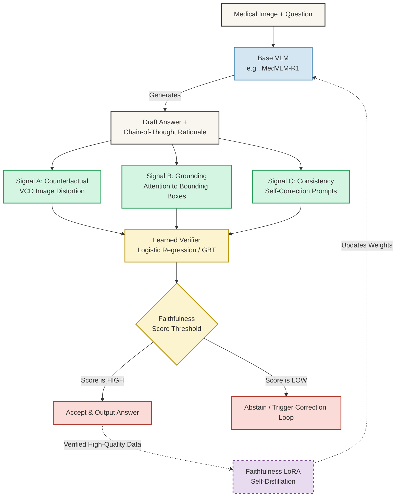

# FMR System Architecture: A Complete Overview

Here is the visual flowchart of your entire thesis architecture, from the moment an image is uploaded to the final medical decision.

---

## How Everything Connects (Your Defense Script)

If a professor asks, *"Walk me through the architecture of your system,"* you can break it down into these **5 logical phases**:

### Phase 1: The Input & Base Generation
* **What happens:** A doctor uploads a medical scan (e.g., Chest X-Ray) and asks a clinical question. This is fed into an off-the-shelf Vision-Language Model (like `MedVLM-R1` or `Qwen2.5-VL`).
* **The Problem:** The model generates a long Chain-of-Thought reasoning path and a final answer. However, because we know these models hallucinate, **we do not trust this draft answer yet.**

### Phase 2: The Tri-Signal Verification (The Core of FMR)
To check if the model is actually looking at the image (grounded) or just making things up, the draft rationale is sent through three independent verification modules:
1. **Signal A (Counterfactual / VCD):** We slightly distort or blank out the image and ask the model again. If the model gives the *exact same confident reasoning* without seeing the image properly, it's hallucinating based on text priors.
2. **Signal B (Attention Grounding):** We extract the model's internal attention matrices (cross-attention). We map the words the model generated back to the image pixels. If it says "Tumor" but is looking at the background, it fails this check.
3. **Signal C (Logical Consistency):** We use a `Verify & Revise` prompt to ask the model to double-check its own logic. If it easily contradicts itself, the reasoning was fragile.

### Phase 3: The Learned Verifier (Fusion)
* **What happens:** We don't just guess how important these three signals are. We pass the results of Signal A, B, and C into your custom **Learned Verifier** (a Scikit-Learn Gradient Boosting Tree or Logistic Regression). 
* **The Output:** The Verifier mathematically fuses these signals together to output a single, definitive **Faithfulness Score (FS)** between 0.0 and 1.0.

### Phase 4: Decision & Action
Based on the Faithfulness Score, the system routes the final action:
* **High Score:** The reasoning is solid, grounded, and verified. The system outputs the answer to the doctor.
* **Low Score:** The reasoning is ungrounded (hallucination). The system triggers **Abstention** (refusing to answer to prevent medical harm) or triggers a **Correction Loop** (forcing the model to rewrite its answer based on visual evidence).

### Phase 5: The Cure (Faithfulness LoRA Ablation)
* **What happens:** Instead of running Phase 1-4 forever, we collect all the perfectly verified answers (the High Score ones) and use them to train a **LoRA adapter** directly onto the Base VLM. 
* **The Goal:** This is an ablation study to see if the model can internalize the "faithfulness" behavior permanently into its neural weights, so it stops hallucinating by default.
